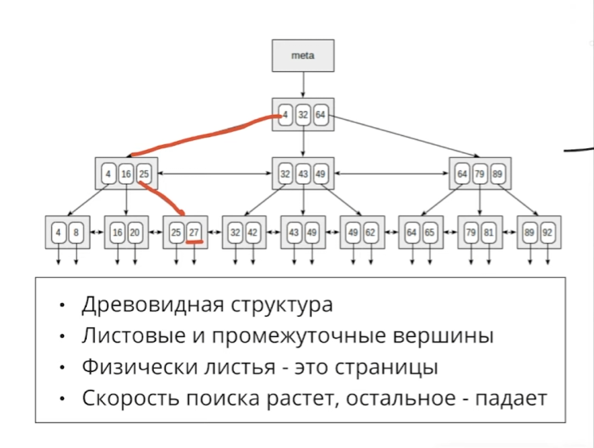
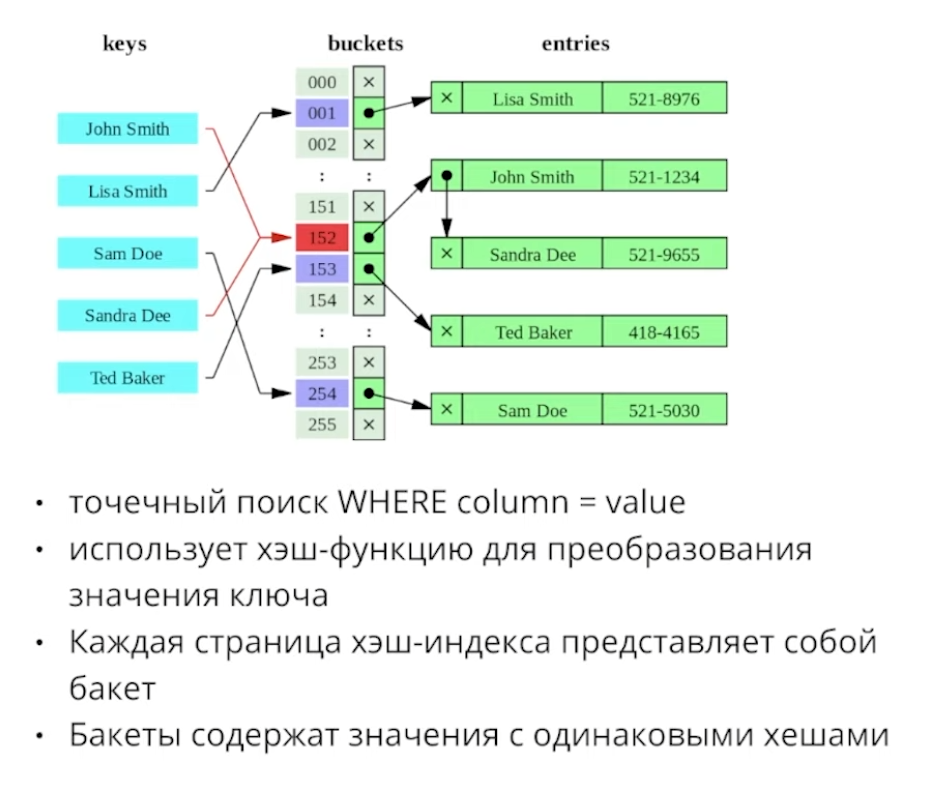
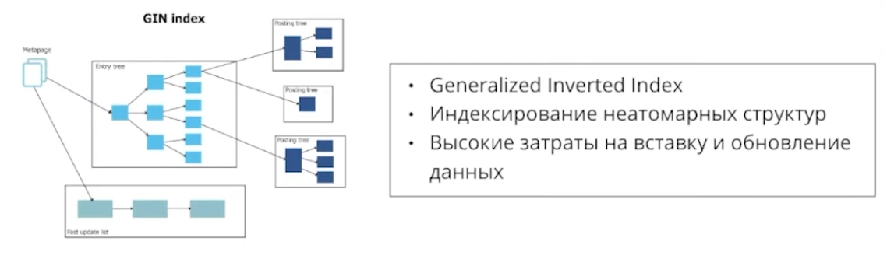

### Введение в индексы
Индекс - это определенная структура данных, которую БД хранит у себя на диске и поддерживает ее упорядоченность. 

Они предназначены для ускорения поиска информации в огромных базах данных.

> Важно отметить, что индексы совсем не бесплатные. Они занимают место на диске, а также делают любые изменения базы данных медленнее, засчет того, что структуру индексов необходимо поддерживать в актуальном состоянии. Индексы нужно создавать с умом.

### Основные виды индексов
**B-Tree**

Позволяет за малое количество итераций найти нужную информацию. Картинка ниже прекрасно описывает принцып работы.

Временная сложность поиска составляет $O(\log n)$. Операции замедления и удаления будут подвергаться замедлению, так как необходимо поддерживать упорядоченность структуры данных. Все вершины дерева это физические страницы, каждая из которых весит по 8 килобайт, поэтому получаемая скорость поиска совсем не бесплатная.

Данный вид индекса прекрасно подходит для поиска по точному совпадению, либо по поиску в диапазоне. Например если бы нам нужно было найти все элементы с полем в определенном диапазоне значений.

**B-Tree** является дефолтным видом индекса почти во всех СУБД. Рассмотрим пример создания индексов через SQL:
```sql
CREATE TABLE events
(
    id              SERIAL PRIMARY KEY,
    cost            INTEGER,
    duration        INTEGER,
    event_date      TIMESTAMP(6),
    location_id     BIGINT,
    owner_id        BIGINT
);

-- Поиск на совпадение
SELECT * FROM events
WHERE location_id = 555;

-- Поиск по диапазону
SELECT * FROM events
WHERE cost < 5000

SELECT * FROM events
WHERE event_date BETWEEN '2024/05/01' AND '2011/06/01'

-- Создание индексов
CREATE INDEX idx_cost ON events(cost);
CREATE INDEX idx_location_id ON events(location_id);
CREATE INDEX idx_event_date ON events(event_date);
```
---
**Hash**

Хэш индекс основывается на хэш таблицах, можно догадаться по названию.

Если вкратце, то на вход берется объект, который мы будем хранить в БД, он прогоняется через специальную математическую функцию. На выходе мы получаем хэш, который будет использоваться для определения места хранения объекта.

В основном данный способ используется для поиска по точному совпадению. В среднем временная сложность составляет $O(\log 1)$.

Самый главный недостаток данного индекса является тот факт, что если в бакетах станет слишком много записей, придется проводить перерассчет всех бакетов для их последующего увеличения.

Для создания хэш индекса надо сделать примерно все то же самое, но использовать ключевое слово `USING`:
```sql
CREATE INDEX idx_hash_email ON users USING HASH(email);
```

---
**Gin**

Для каждого элемента создается список мест, где этот элемент встречается. Можно сказать обратный индекс. Это все конечно круто, но вставка очень сильно замедляется.

Пример использования:
```sql
CREATE TABLE documents (
    id SERIAL PRIMARY KEY,
    content TEXT
);

INSERT INTO documents (content) VALUES
('PostgreSQL is a powerful, open source object-relational database system.'),
('Learning SQL is essential for managing relational databases.');

SELECT id, content
FROM documents
WHERE content ILIKE '%Postgre%';

CREATE INDEX idx_gin_trgm_content ON documents USING GIN (content gin_trgm_ops);
```
Для поиска по JSON тоже офигенно подходит:
```sql
CREATE TABLE documents (
    id SERIAL PRIMARY KEY,
    content JSONB
);

INSERT INTO documents (content) VALUES
('{"title": "PostgreSQL Guide", "author": "Jane Doe"}'),
('{"title": "Learning SQL", "author": "John Smith"}'),
('{"title": "ADvanced PostgreSQL", "author": "Jane Doe"}');

-- @> sign is used to check whether content column has this specific json object
SELECT id, content
FROM documents
WHERE content @> '{"author": "Jane Doe"}';

CREATE INDEx id_gin_content ON documents USING GIN (content);
```

Также подходит для поиска по массиву. В данном случае будет искаться строка с книгой, у которой есть хотябы один из перечисленных тегов.
```sql
CREATE TABLE books (
    id SERIAL PRIMARY KEY,
    tags TEXT[]
);

CREATE INDEX idx_gin_tags On books USING GIN (tags);

SELECT * FROM books WHERE tags @> '{science, fiction}';
```